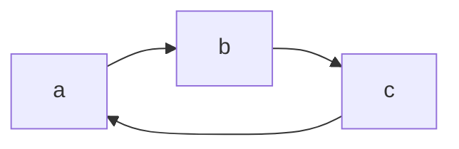

# Structure et algorithmes aléatoires

[TOC]

## Introduction

Probabilités discrètes : espaces au plus dénombrables, et application à différents domaines.
Complémentaire au cours d'intégration et probabilités

### Références

- Mitzenmacher & Upfal : *Probability and Computing : Randominzed Algorithms and Probabilitic Algorithms*
- Pierre Brémaud : *Discrete Probabilitiy Models and Methods*

### Programme

- Probabilités discrètes et applications
  - Rappels : variables aléatoires, indépendance, espérance et variance, quelques inégalités, fonctions génératrices, boules et urnes
  - Algorithmes aléatoires
  - Méthode probabiliste
  - Graphes aléatoires
- Modèles markoviens
  - Chaînes de Markov, comportement asymptotique
  - Simulation de Monte Carlo et simulation parfaite
  - Extensions et applications : modèles markoviens cachés, modèles markoviens de décision, champs de Gibbs, automates cellulaires probabilistes

### Chaîne de Markov

Soit $\{X_n, n \in \mathbb N\}$ une suite de variables aléatoires (un processus stochastique) à valeurs dans une espace d'états E au plus dénombrable.

Le processus $\{X_n, n \in \mathbb N\}$ est appelé une chaîne de Markov à temps discret sur $E$ si pour tout $n \in \mathbb N$ pour tous $i,j,i_1,...,i_{n-1} \in E$,

$P(X_n+1=j | X_n=i, ..., X_0=i_0) = P(X_n+1 = j | X_n = i)$

## Algorithme probabiliste

**Algorithme déterministe** est tel que pour chaque entrée, il existe une et une seule valeur de sortie.

On veut une réponse rapide et correcte, ce que l'on ne sait pas toujours faire avec un algorithme de déterministe.

On peut ajouter de l'aléa sous forme de **bits aléatoires** : plus une unique sortie pour chaque entrée. La sortie est une variable aléatoire.

On peut modifier l'algorithme de sorte à avoir

- Soit une réponse correcte dans tous les cas et rapide dans la plupart des cas.
- Soit une réponse correcte dans la plupart des cas, mais rapide dans tous les cas.

**Exemple** :

**Problème** : deux polynômes de degré $d$ sont-ils égaux ?

Un algo naïf nécessite $\mathcal O(d^2)$ opérations pour développer.

**Algo probabiliste**

Choisir $r$ dans $\{1,...,100d\}$ uniformément

Calculer $F(r)$ et $G(r)$ (en $\mathcal O(d)$). Si $F(r)=G(r)$ alors $F=G$, sinon $F\ne G$.

On se trompe uniquement si $F\ne G$ et $r$ est une racine de $F-G$.

Au plus $d$ racines dans $\{1,...,100d\}$ $\Rightarrow$ probabilité que l'algorithme se trompe est au plus de $1/100$

Attention, pour plus de précision on pourrait vouloir exécuter plusieurs fois l'algo, mais il ne faut alors pas dépasser la complexité de l'algorithme déterministe pour que cela soit intéressant.

### Classification des algorithmes probabilistes

**Algorithmes de Monte Carlo** : complexité déterministe mais peut se tromper avec erreur contrôlée.
**Erreur unilatérale :** renvoie `vrai` ou `faux` mais ne se trompe que sur une des valeurs
**Erreur bilatérale :** peut se tromper sur les deux valeurs
Si la proba d'erreur est <1/2, alors on peut diminuer cette proba en exécutant plusieurs fois l'algorithme et en renvoyant la réponse majoritaire.

**Algorithmes de Las Vegas** : résout un problème exactement, avec une complexité moyenne finie (que l'on cherche à minimiser)
**Exemple :** choix uniforme du pivot dans l'algorithme du tri rapide

Un algorithme Monte Carlo de complexité $C_{MC}$ qui renvoie soit la réponse correct, soir `erreur` (avec proba au plus p), on peut transformer cet algo en un algorithme de type Las Vegas en le répétant tant que la réponse renvoyée est `erreur`. Alors la complexité de l'algorithme Las Vegas est alors $E(C_{LV}) \le C_{MC}/p$

**Terminaison :**

- Un algo termine avec proba $\alpha$
- Un algorithme termine presque sûrement
- Un algorithme termine sûrement

**Modèle** : une file d'attente

$X_n$ clients après le départ du $n$-ième paquet. $X_0 = 0$.
$A_n$ : nombre de clients qui arrivent pendant le service du $n$-ième client.
Alors : $X_{n+1} = max(X_n -1,0)+A_n$

$(X_n)$ forme un processus stochastique si $A_n$ est décrit de manière probabiliste.
Sous certaines conditions, $(X_n)$ est ce qu'on appelle une chaîne de Markov, qui fait l'objet de la seconde partie du cours.

**Questions :**

- comportement asymptotique (stabilité) ?
- Quelle est la taille moyenne de la file d'attente ?
- Et si le nombre de clients double, que faut-il faire pour garder le même temps moyen d'attente qu'avant ?
- Si on a deux files d'attentes, faut-il avoir des salles d'attentes séparées ou une salle commune ?

## Méthode probabiliste

### Tribus et événements

**Univers** : $\Omega$ - un ensemble qui décrit toutes les possibilités d'une expérience. Par exemple, pour un dé, on a $\Omega = \{1,2,3,4,5,6\}$. Les éléments de $\Omega$ sont appelés les événements élémentaires (les éventualités)

**Définition** : une tribu sur $\Omega$ est une famille $\mathcal F$ de sous ensemble de $\Omega$ qui contient $\emptyset$, $\Omega$, est stable par passage au complémentaire, par réunion dénombrable (intersection dénombrable).

La **tribu grossière** est la plus petite tribu sur $\Omega$.

La **tribu fine** est la plus grosse tribu sur $\Omega$.

**Exemples d'événements plus complexes** (espaces non dénombrables) :

- $\Omega = \{0,1\}^{\mathbb N}$ : une suite infinie de lancers de pièce.
- $A$=l'événement concerne uniquement les $k$ premiers lancers.
- Les événements de type $A$ ne forment pas une tribu, on considère donc la tribu engendrée (la plus petite tribu contenant les événements de type $A$). (Ici il s'agit de la tribu engendrée par les cylindres finis)

### Espace de probabilités

**Définition** : une probabilité sur une espace probabilisable $(\Omega, \mathcal F)$ est une application $P : F \rightarrow [0,1]$ telle que $P(\Omega) = 1$, et $P$ est sigma-additive.

**Propriétés** :

- Passage au complémentaire
- Monotonie
- Union bound ($P(\bigcup A_i) \le \sum P(A_i)$)
- Continuité séquentielle : La probabilité d'une union croissante des $A_n$ peut être exprimée comme la limite des $P(A_n)$
- Idem pour les intersections décroissantes

**Exemple (retour sur les polynômes)** : Augmenter la précision, comment

- Augmenter l'espace. Problème: précision sur les grands entiers
- Répéter l'algorithme plusieurs fois
  - On peut choisir avec ou sans remplacement des valeurs déjà tirées. Dans le premier cas, les tirages sont indépendants.

### Indépendance

**Définition** : deux événements $A$ et $B$ sont indépendants si $P(A \cap B) = P(A)P(B)$.
Une famille d'événements est mutuellement indépendants si toute sous-famille finie d’évènements est indépendante ($P(\bigcap A_i) = \prod P(A_i)$).

### Probabilité conditionnelle

**Définition** : Probabilité d'un événement $A$ conditionné par $B$ est : $P(A|B) = \frac{P(A \cap B)}{P(B)}$ (uniquement définie si $P(B) > 0$)

**Théorème** : Formule des probabilités composées : P$(E_1 \cap \dots \cap E_n) = P(E_1)P(E_2 | E_1)...P(E_n | E_{n-1} \dots E_1)$.

**Exemple**  : Tirage des racines sans remise : un calcul montre que c'est une erreur plus petite qu'avec remplacement.

En pratique il est parfois plus judicieux d'implémenter la version avec remplacement.

**Théorème** : loi des probabilités totales : $P(A) = \sum_i P(A | E_i)P(E_i)$ pour $(E_i)$ partition de $\Omega$

**Théorème** : loi de Bayes : $P(A|B) = \frac{P(A)P(B|A)}{P(B)}$

**Exercice :** vérification d'une multiplication matricielle :
Meilleur qu'un algo naïf ($\mathcal O(n^3)$) : algo probabiliste. Soit $r \in \{0,1\}^n$.

Complexité de $ABr=Cr$ : $\mathcal O(n^2)$ ($Br$ puis $ABr$ et $Cr$. Chaque calcul est en $\mathcal O(n^2)$.)
Proba d'erreur : $\le 1/2$ (calcul bourrin par formule des probabilités totales)

### Variables aléatoires

**Définition** : $(\Omega, \mathcal F, P)$ espace de probabilité. $E$ un ensemble au plus dénombrable. Une fonction $X:\Omega -> E$ telle que $\forall x\in E, \quad \{\omega | X(\omega) = x\} \in \mathcal F$ est une variable aléatoire discrète sur $E$. (techniquement il faut aussi la condition de mesurabilité de $X$)

**Propriété :** toute image d'un $n$-uplet de v.a. est une v.a.

**Exemples de distributions :**

- Loi constante
- Loi de Bernouilli
- Loi binomiale
- Loi géométrique (sans mémoire)
- Loi de Poisson
- ...

### Espérance

**Propriété** : linéarité

**Propriété ** : monotonie si $f(X) < g(X)$ p.s. alors $E(f(X)) < E(g(X))$

**Propriété** : indépendance : $E(XY) = E(X)E(Y)$ si $X$ et $Y$ sont indépendantes

### Variance

**Propriété** : $Var(X,Y) = Var(X) + Var(Y) + 2Cov(X,Y)$

**Propriété** : Si $X$ et $Y$ sont indépendantes, $Cov(X,Y) = 0$

**Propriété** : Si $X$ et $Y$ sont indépendantes, $Var(X+Y)=Var(X)+Var(Y)$

### Inégalités

**Inégalité de Jensen** : Si $\phi$ est une fonction convexe, $X$ et $\phi(X)$ ont une espérance, alors $E[\phi(X)] \ge \phi(E[X])$

**Inégalité de Markov** : $X$ v.a.$\ge 0$. Alors $P(X\ge a) \le E[X]/a$.

**Exemple :** lancer de pièces non biaisées (n fois). Borner la proba d'obtenir au moins $3n/4$ fois face. Markov donne $P(X\ge 3a/4) \le 2/3$.

**Inégalité de Tchebychev** : $P(|X-E(X)| \ge a) \le Var(X)/a^2$
Sur le lancer de $n$ pièces, $P(X\ge 3n/4) \le 4/n$

**Exemple :** collectionneur de coupons
Chaque boîte contient un et un seul coupon, tiré de manière uniforme parmi toutes les possibilités et indépendamment des autres boîtes. Il y a $n$ coupons au total. Combien de boîtes faut-il acheter en moyenne pour obtenir tous les coupons ?
Soit $X$ le nombre de boîtes pour obtenir n coupons. On cherche $E[X]$.
Soit $X_i$ le nombre de boîtes ouvertes depuis que le collectionneur a obtenu i-1 coupons jusqu'à l'obtention du $i$-ème coupon. On a $X=X_1+...+X_i$
Distribution des $X_i$ : géométrique de paramètre $(n-(i-1))/n$. $E[X_i] = n/(n-i+1)$
Donc $E[X] = nH(n)$ avec $H(n)$ somme harmonique.

**Question : **quelle est la probabilité que le temps pour collectionner les n coupons soit au moins le double de cette espérance ?
Markov : $1/2$
Tchebychev : indépendance donc variance linéaire. Tchebychev donne : $\frac{\pi^2}{6H(n)^2}$
Indégalité de Boole (union bound) donne $1/n$

### Méthodes probabilistes pour l'analyse de problèmes d'existence

- Argument de comptage
- Méthode du premier moment
- Méthode du second moment

**Idée** : prouver l'existence d'objets satisfaisant certaines propriétés par des arguments probabilistes. Dans certains cas, on pourra construire effectivement ces objets.

#### Méthode de comptage

- On dispose d'une collection au plus dénombrables d'objets $a_i, i\in I$.

- Objectif : prouver que l'un d'eux au moins satisfait une propriété $\mathcal P$.

##### Exemple : nombre de Ramsey

Coloriage des arêtes d'un graphe complet $K_n$ en deux couleurs, rouge et bleu de telle manière qu'il n'y ait pas de grande clique monochrome. (clique : sous-graphe complet)

$R(k)$ est le nombre minimum de sommets tel que pour chaque coloriage des arêtes, il existe une clique de taille $k$ monochrome.

**Théorème:** si $\binom n k 2^{-\binom n 2 +1} < 1$, alors $R(k) > n$ (il est possible de colorier $K_n$ t.q il n'y a pas de clique de tailel $k$ monochrome)

**Démo :** il y a $2^{\binom n 2}$ coloriage possibles des arêtes $K_n$ avec deux couleurs.

Choix uniforme de coloriage : on colorie les arêtes iid (indépendante et identiquement distribuées) (i.e. chaque couleur avec proba $1/2$)

Soit $i = 1, \dots, \binom n k$ une énumération des cliques de taille $k$.

Soit $A_i$ l'événement "$i$ est une clique monochrome". Alors $P(A_i) = 2^{-\binom k 2 + 1}$ (deux choix parmi les $2^{\binom k 2}$ coloriages de cette clique possible).

Donc $P(\cup_{i=1}^{\binom n k} A_i) \le \sum_{i=1}^{\binom n k} P(A_i) = \binom n k 2^{-\binom k 2 + 1} < 1$ et $P(\cap_{i=1}^{\binom n k} \bar{A_i}) = 1 - (\cup_{i=1}^{\binom n k} A_i) > 0$. Il existe donc un tel coloriage.

**Construction effective ($k$ constant)**

On construit un algorithme de type Monte-Carlo. : on colorie chaque arête uniformément et indépendamment.
Ensuite, on vérifie qu'il n'y a pas de clique de taille $k$ dans le graphe $\mathcal O(n^k)$. Alors, la probabilité d'échec est donc : $p=P(\cup_{i=1}^{\binom n k} A_i)$

Transformation en algorithme Las-Vegas : répéter tant qu'on trouve une clique monochrome :

$E(\text{temps d'exécution}) = \mathcal O \left(\frac{n^k}{\binom n k2^{-\binom k 2 + 1}} \right)$ 

#### Méthode du premier moment

**Théorème** : si $X$ est une v.a. alors $P(X \ge E[X]) > 0$ et $P(X \le E[X]) > 0$.

##### Application 1 : MAXSAT

**Problème :** $F$ formule en FNC (ou CNF en anglais).

**Question :** quel est le nombre maximal de clauses satisfiables.

**Problème de décision associé (NP-complet) :**

*Données :* $F, k$.

*Question :* existe-t-il une affectation des variables telles que $k$ clauses au moins sont satisfiables ?

**Théorème :** soit $F$ une formule à $m$ clauses, $k_i$ le nombre de littéraux de la $i$-ème clause et $k=\min k_i$. Il existe une affectation des variables qui satisfait au moins $\sum_{i=1}^m (1-2^{-k_i}) > m(1-2^{-k})$ clauses.

**Démo :**

On note $x_1 \dots x_n$ les variables de la formule. On affecte de manière uniforme une valeur booléenne à ces variables. Soit $E_j$ "la $j$-ième clause est satisfaite" et $Y_j= 1_{E_j}$. On a $E[Y_j] = 1-2^{-k_j}$. Soit $Y=\sum Y_j$. On a alors : $E[Y]=\sum_{i=1}^m (1-2 ^{-k_j}) \ge m(1-2^{-k}) > 0$ 

Comme $P(Y \ge E[Y]) > 0$, cela prouve l'existence d'une affectation qui satisfasse cette clause.

**Algorithme de construction :**

Utiliser les espérances conditionnelles par rapport à une affectation déjà en partie construite : $E[Y] = E[Y|X_1=1]P(X_1 = 1)+E[Y|X_1=0]P(X_1 = 0) \le \max(E[Y|X_1 = 1], E[Y|X_1=0])$.

On choisit alors l'affectation qui maximise l'espérance, et on reprend de manière similaire sur les autres valeurs.

**Problème: ** calculer les espérances.

##### Application 2 : Ensembles indépendants

Soit $G=(V,E)$ un graphe. Un ensemble de sommets $I$ et dit indépendant si les différents sommets ne sont pas connectés. On note $n = |V|, m=|E|$.

**Théorème :** si $2m/n > 1$ alors $G$ possède un ensemble indépendant de tailel au moins $n^2/4m$.

**Démo :** si $n>m$, alors il existe un indépendant de taille $n-m$ (on peut enlever un sommet extrémité dechaque arête).

Une première phase d'un algorithme de construction consiste donc à enelever des ommets (et les arêtes qui y sont adjacentes).

Algorithme 1 :

$p\in [0,1]$.

1. Effacer chaque sommet avec probabilité $1-p$ indépendamment
2. Pour chaque arête restante, la retirer, ainsi qu'un sommet adjacent.

(cela revient à garder des sommets avec probabilité $p$ et considerer le sous-graphe engendré)

Calcul de l'espérance du nombre de sommets et d'arêtes obtenus à la fin.

1. $X$ le nombre de sommets restants après la 1ere arête : $E[X] = np$.
2. Soit $Y$ le nombre d'arêtes à la fin de la première étape. $E[Y] = mp^2$ : une arête survit si aucun des sommets qu'elle relit n'est supprimé, ce qui arrive avec probabilité $p^2$ (par indépendance).

À la deuxième étape, on retire un sommet par arête au plus. Le nombre de sommets restants est donc d'au moins $X-Y$ et $E[X-Y] = np - mp^2$.

On choisit $p$ qui maximise le nombre de sommets restants, ce qui est pour $p=\frac n {2m}$ qui est $\le 1$ par hypothèse. Donc $E[X-Y] = \frac{n^2}{2m} - \frac{n^2}{4m} = \frac{n^2}{4m}$.

**Remarque :** $d=\frac 1 p = \frac {2m} n$ est le degré moyen du graphe.

#### Méthode du second moment

**Théorème :** soit $X$ une variable aléatoire sur $\mathbb N$. Alors $P(X\ne X) \le E[X]$.

**Démo :** inégalité de Markov avec $a=1$.

**Théorème :** dans le même cas, $P(X=0) \le \frac{Var(X)}{E[X]^2}$.

**Démo :** Tchebychev avec $a=E[X]$.

##### Graphes aléatoires (Erdös-Rényi)

Soit $n\in \mathbb N$ et $p\in[0,1]$. L'espace $\mathcal G(n,p)$ est l'espace des graphes non orientés avec $n$ sommets et où chaque arête a une probabilité $p$ d'exister, indépendamment des autres.

On a $\mathcal G(n,p) = (\Omega_n, \mathcal P(\Omega_n), P)$ où

- $\Omega_n$ est l'ensemble des graphes non orientés avec $n$ sommets $\{1, \dots, n\}$.
- Si pour $1 \le u < v \le n, E_{u,v}$ est l'événement "il y a une arête entre les sommets $u$ et $v$", $(E_{u,v})$ est une famille d'événements mutuellement indépendants et $P(E_{u,v}) = p$.

Il y a au plus $M=\binom n 2$ arêtes dans un graphe à $n$ sommets et il y a $2^M$ graphes possibles.

Dans la suite, soit $G_{n,p}$ un tel graphe.

Dans $\mathcal G(n,p)$,

- le graphe complet a probabilité $p^M$,
- le graphe vide a probabilité $(1-p)^M$,
- la probabilité que $G_{n,p}$ ait $m$ arêtes est $\binom M m p^m (1-p)^{M-m}$.

On veut étudier les comportement de certaines propriétés des graphes quand le nombre de sommets croît vers l'infini et

1. $p$ est fixé
2. $p$ est une fonction de $n$

Pour la propriété A, une **fonction seuil** est une fonction $g(n)$ telle que

(i) Si $p << g$ ($p=o(g)$) alors $\lim (P(G_{n,p(n)} \text{ satisfait } A)) = 0$

(ii) Si $p >> g$, cette limite vaut $1$

##### Variance d'une somme de v.a. binaires

**Lemme :** soient $Y_i \in \{0,1\}, i=1, \dots, m$ des variables aléatoires et $Y=\sum_{i=1}^m Y_i$. Alors $Var[Y] \le E[Y] + \underset{1 \le i,j \le m; i\ne j}{\sum} Cov(Y_i,Y_j)$

**Démonstration :** $Var[Y] = \sum_{i=1}^m Var[Y_i] + \underset{1 \le i,j \le m ; i\ne j}{\sum} Cov(Y_i,Y_j)$. Quand $Y_i \in \{0,1\}, E[Y_i^2] = E[Y_i]$ et donc $Var[Y_i] = E[Y_i^2] - E[Y_i]^2 \le E[Y_i]$. D'où le résultat souhaité.

##### Exemple: clique de taille 4

**Théorème :** si A = "contenir une clique de taille 4", alors la fonction seuil est $g(n)=n^{-2/3}$. Plus précisément,

- si $p(n) << n^{-2/3}$, alors $\underset{n \rightarrow \infty}{\lim} P(G_{n,p(n)} \text{ satisfait }A) = 0$
- si $p(n) >> n^{-2/3}$, alors $\underset{n \rightarrow \infty}{\lim} P(G_{n,p(n)} \text{ satisfait }A) = 1$

**Démonstration :** La première assertion se prouve en utilisant l'inégalité de Markov et la seconde en utilisant la méthode du second moment.

Soit $C_1, \dots, C_{\binom n 4}$ une énumération des ensembles de $4$ sommets et définissions les variables aléatoires $X_i \in \{0,1\}, i \in \{1, \dots, \binom n 4\}$ avec $X_i = 1 \Leftrightarrow C_i$ est une clique de taille $4$.

On pose $X=\sum_i X_i$. Nous avons $E[X_i^2]=E[X_i], \forall i$ et

- $E[X]= \sum_i E[X_i] = \binom n 4 p(n)^6 = (\frac 1 {24} n^4 + o(n^4))p(n)^6$
- $Var[X] \le E[X] + \underset{1 \le i,j \le m ; i \ne j}{\sum} Cov(X_i, X_j)$

Calcul de $Cov(X_i,X_j)$ avec $i \ne j$ :

- Si $|C_i \cap C_j| = 0$ alors les deux cliques sont disjointes et $X_i$ et $X_j$ sont indépendants. Donc $Cov(X_i,X_j) = 0$.
- Si $|C_i \cap C_j| = 1$ alors $X_i$ et $X_j$ sont également indépendants et $Cov(X_i,X_j)=0$.
- Si $|C_i \cap C_j| = 2$ alors les deux cliques partagent une arête. $11$ arêtes doivent être dans le graphe (2 cliques de taille 4 qui se superposent sur 2 sommets), d'où $Cov(X_j,X_j) = E[X_iX_j] - E[X_i]E[X_j] \le E[X_iX_j] \le p^{11}$.Il y a $\binom n 6$ possibilités de choisir les 6 sommets et $\binom 6 {2;2;2}$ possibilités de les séparer en $C_i$ et $C_j$.
- Si $|C_i \cap C_j| = 3$, alors les deux cliques partagent $3$ arêtes. $9$ arêtes doivent être dans le graphe. Donc $Cov(X_i,X_j) \le E[X_iX_j] \le p^9$. Il y a $\binom n 5$ possibilités de choisir les $5$ sommets et $\binom 5 {3;1;1}$ possibilités de les séparer en $C_i$ et $C_j$.

Nous avons donc : $Var[X] \le \binom n 4 p(n)^6 + \binom n 6 \binom 6 {2;2;2}p(n)^{11} + \binom n 5 \binom 5 {3 ; 1; 1} p(n)^9$.

Maintenant :

- Si $p(n) = o(n^{-2/3})$, alors par Markov, $P(X\ne 0) \le E[X] = \binom n 4 p(n)^6 = (\frac 1 {24} n^4 + o(n^4))p(n)^6 = o(1)$.
- Si $n^{-2/3}=o(p(n))$, alors $Var[X] \le \binom n 4 p(n)^6 + \binom n 6 \binom 6 {2;2;2}p(n)^{11} + \binom n 5 \binom 5 {3;1;1}p(n)^9 = o(n^8p(n)^{12}) = o(E[X]^2)$, puisque $E[X]^2 = (\binom n 4 p(n)^6)^2 = \Theta (n^8p(n)^{12})$. Ainsi, $P(X=0) \le \frac{Var[X]}{E[X]^2} = o(1)$.

#### Lemme local de Lovasz

$E_1, \dots, E_n$ événements non désirables. On veut montrer $P((\bigcup_{i=1}^n E_i)^\complement) > 0$

Deux approches jusqu'à présent :

1. Union bound
2. Événements mutuellement indépendants. 

##### Graphe de dépendance

**Définition**: $G=(E,V)$ avec $V= \{1, \dots, n\}$ et $E_i$ mutuellement indépendant des $\{E_j, (i,j)\notin E\}$. Degré de dépendance : le degré maximum du graphe de dépendance.

*Ex:* une formule en CNF. Événements $E_j$ : «la $j$-ième clause n'est pas satisfaite». On affecte les variables i.i.d. Sur la formule du slide, $E_4$ est mutuellement indépendant de $E_1$ et $E_2$.

##### Théorème (lemme local de Lovasz symétrique)

Soient $E_1, \dots, E_n$ des événements tels que

1. $\forall i \in \{1, \dots, n\}, P(E_i) \le p \qquad 0< p < 1$.

2. Le degré de dépendance de $E_1, \dots, E_n$ est borné par $d$.

3. $4pd \le 1$

   Alors $P(\bigcap_{i=1}^n E_i^\complement) > 0$.

**Demo : cf slides**.

**Rem :** l'inégalité de Boole demande $pn \le n$ donc le lemme de Lovasz est meilleur dès que $d \le n/4$.

**Exemple** : k-SAT.

*Données :* formule $F$ en CNF avec exactement $k$ littéraux par clause. Question : $F$ est-elle satisfiable,

**Théorème :** si aucune variable n’apparaît plus de $2^k/4k$ fois ou si aucune clause ne partage de variable en commun avec $2^{k-2}$ autres clauses, alors la formule est satisfiable.

**Démo :** Soit $E_j$ l'événement «la clause $j$ n'est pas satisfaite». On affecte les variables iid selon une loi de Bernouilli de paramètre $1/2$. Alors $P(E_j) \le 2^{-k}$.

$E_j$ est mutuellement indépendant des événements concernant des clauses qui n'ont pas de variable en commun avec la $j$-ième.

Chaque variable apparaît au plus $2^k/4k$ fois, donc $d \le k \cdot 2^k/4k = 2^{k-2}$. (La même borne du degré avec l'autre énoncé). Donc $4dp \le 1$

**Théorème (Erdos, Lovasz, 1975)**

Soient $E_1, \dots, E_n$ des événements dans un espace de proba arbitraire et $G$ le graphe de dépendance de ces événements. S'il existe des nombres $x_i \in [0,1[$ tels que $\forall i \le n, P(E_j) \le x_i \underset{ j, (i,j)\in E} \prod (1-x_j)$

Démo semblable à celle du cas symétrique (cf TD).

##### Graphe de dépendance négative (negative dependancy graph)

On veut remplacer la condition d'indépendance mutuelle par $P(E, \cap_{i\in I} E_i) \le P(E)$.

**Définition : graphe de dépendance négative** de même que le graphe de dépendance.

**Théorème : Lemme local de Lovasz symétrique à dépendance négative**.

(même énoncé).

**Théorème : Erdos, Spencer, 1991** 

Demo : récurrence sur la taille de $S$, un sous-ensemble de sommets. $P(E_k | \underset {j\in S} \bigcap E_j^\complement) \le 2p$ et $P(\underset {j\in S}\bigcap E_j^\complement) > 0$.

$P(\bigcap ...) = \prod P(E_i | \bigcap_{i=1}^{s-1}) \ge (1-2p)^s > 0$.

$S_1 = S\cap V(k)$ avec $V(k)$ le voisinage de $k$, $S_2 = S \cap V(k)^\complement$.

Si $S=S_2$ : $P(E_k|\underset {j\in S} \bigcap E_j^\complement) \le P(E_k) \le p \le 2p$.

Si $S\ne S_2$ : $P(E_k | F_S) = P(E_k \cap F_{S_1} | F_{S_2}) \le P(E_k | F_{S_2}) \le P(E_k)  \le p$

(même forme que le cas indépendance)

##### Graphe de dépendance $\varepsilon$-positif ($\varepsilon$-near positive graph)

Graphe : 

- $\forall (i,j) \in E, P(E_i \cap E_j) = 0$

- $\forall i, \forall S \subseteq [\![ 1, n ]\!]\setminus V(i), i \notin S, P(E_i | \underset{j\in S}\bigcap E_j^\complement) \ge (1-\varepsilon)P(E_i)$

On montre $P(\bigcap_{j=1}^n E_j^\complement) \le \prod_{i=1}^n (1-(1-\varepsilon)P(E_i))$

**Demo** :

$P(\bigcap_j E_j^\complement) = 0$ : ok

$P(\bigcap_j E_j^\complement) > 0$ :

- $S \subseteq [\![1,n]\!], i \notin S, p(E_i | \underset{j\in S} \bigcap E_j^\complement) \ge (1-\varepsilon)P(E_i)$ ($F_S := \underset{j\in S} \bigcap E_j^\complement)$)
	- $S_1 := S\cap V(k)$, $S_2 = S \setminus S_2$.
	- $P(E_i | F_S) = \frac{P(E_i \cap F_{S_1} | F_{S_1})}{P(F_{S_1} | F_{S_2})} \ge P(E_i \cap F_{S_2} | F_{S_2}) = P(E_i \cap (\underset{j\in S_1}\bigcap E_j^\complement) | \underset {k \in S_2} \bigcap E_k^\complement)$
 - $P(B\cap A^\complement) = P(B) - P(B\cap A)$
   donc $P(E_i|F_S) \ge P((E_i \cap E_k^\complement) \cap (\underset{j\in S_2\setminus\{k\}} \bigcap E_j^\complement | \underset {k\in S_2} \bigcap E_k^\complement) = P(E_i \cap (\underset {j\in S_2} \bigcap E_j^\complement) | \underset{k\in S_2} \bigcap E_k^\complement) - 0$
	- On a de la sorte éliminé une coordonnée, et ainsi de proche en proche, on obtient $P(\bigcap_{j=1}^n E_j^\complement) = \prod_{i=1}^n P(E_i^\complement | \bigcap_{k=i+1}^n E_k^\complement)(1-P(E_i|F_{[\![i+1, k]\!])} \le (1-(1-\varepsilon) P(E_i))$

##### Lemme local de Lovasz : version constructiviste. (Moser et Tardos)

### Fonctions génératrices et applications

#### Définition

- $X$ une v.a. sur $\mathbb N$

- $f : \mathbb N \rightarrow \mathbb C$ avec $f_R$ et $f_I$ ses parties réelles et imaginaires.
- $E(f(X)) = E(f_R(X)) + E(f_I(X))$

**Definition**

$g_X:\begin{aligned} \{s\in \mathbb C, |s|<1\} &\rightarrow \mathbb C \\ s &\mapsto E[s^X] = \sum_{k=0}^\infty s^kP(X=k) \end{aligned}$

Principalement vue comme une fonction définie sur $[0,1]$.

#### Propriétés

- $g_X$ est $\mathcal C^\infty$ sur $]-1,1[$
- $g_X(0)=P(X)=0$
- $g_X(1)=1$
- $P(X=n)=g_X^{(n)}(0)/n!$

- Les dérivées de $g_X$ en 1 donnent les moments de $X$

  - $g_X^{(k)}(1) = E(X^k) + \alpha_{k-1}E(X^{k-1}) + \dots + \alpha_1E(X)$
  - Si $X$ et $Y$ sont indep, $g_Xg_Y = g_{X+Y}$

  - Demo : $E[s^{X+Y}]=E[s^X]E[s^Y]$

- Si il existe $\delta >0$ tel que $\forall s\in [0, \delta] , g_X(s)=g_Y(s)$, alors $X$ et $Y$ ont la même distribution.

- Exemples

  - $X \approx Ber(p) : g_X(s) = 1- p + ps$
  - $X \approx Bin(n,p) : g_X(s) = (1-p+ps)^n$
  - $X \approx Geo(p) : g_X(s) = \sum s^n(1-p)^{n-1}p = \frac{ps}{1 - (1-p)s}$

#### Somme aléatoire, égalité de Wald

$T$ v.a. dans $\mathbb N$, $(Z_i)$ une suite de v.a. i.i.d et indépendantes de $T$. Soit $X = \sum_{i=0}^T Z_i$. Alors $g_X = g_T \circ g_Z$.

**Demo** :

$s^{Z_1+\dots Z_T} = \sum 1_\{T=n\}s^{Z_1+ \dots Z_n}$. Donc $E(s^{Z_1+\dots Z_T}) = \sum E(1_\{T=n\}s^{Z_1+ \dots Z_n})$ (linéarité). $E(s^{Z_1+\dots Z_T})= E(E(1_\{T=n\})E(s^{Z_1+ \dots Z_n}) = \sum P(T=n)(g_Z(s))^n = E(g_Z(s)^T) = g_T \circ g_Z$.

**Corollaire**

$E(X) = E(Z)E(T)$

**Demo** : 

$E(X) = g_X'(1) = g_Z'(1)g_T'(g_Z(1))=g_Z'(1)g_T'(1) = E(Z)E(T)$.

#### Processus de branchement de Galton-Watson

Initialement introduit pour étudier l'extinction ou la survie des noms des familles aristocratiques de l'Angleterre victorienne.

Construction:

- $X_0 = 1$ (la racine, niveau 0)
- $X_n$ est le nombre de noeuds au niveau $n$ (ou à la $n$-ième génération).
- On note $Z_i^{(n)}$ le nombre d'enfants du $i$-ème noeud de la $n$-ème génération : les $(Z_i^{(n)})$ sont iid avec la même loi qu'une v.a. $Z$.
- On a $X_{n+1} = \sum_{i=1}^{X_n}Z_i^{(n)}$

On s'intéresse à la propriété d'extinction.

**Notations** :

- $g_Z(s) = E(s^ Z)$ la fonction génératrice de $Z$
- $\phi_n(s) = E(s^{X_n})$ cella de $X$.

**Lemme** : $\phi_{n+1}=g_Z(\phi_n)=g_Z^{n+1}$

D'après l'égalité de Wald, $\phi_{n+1}=\phi_n \circ g_Z$. Alors $\phi_{n+1} = \phi_0 \circ g_Z \dots \circ g_Z = \phi_0 \circ g_Z^{n+1}$. Mais $\phi_0 = Id$ donc $\phi_{n+1}=g_Z^{n+1}$. Il s'en suit que $\phi_{n+1}=g_Z(\phi_n)$.

Soit $p_e$ la probabilité d'extinction du processus : $p_e = P(\exists n \in \mathbb N, X_n =0) = P(\bigcup_{n\in \mathbb N}\{X_n=0\})$.

Comme $\{X_n = 0\} \subset \{X_{n+1}\}$, par continuité séquentielle, on a : $p_e = \lim P(X_n = 0)$.

**Lemme** : $p_e = g_Z(p_e)$.

**Demo** : $\phi_{n+1}(0) = g_Z(\phi_n(0))$. Aussi, $\phi_{n+1}(0) = P(X_{n+1}= 0)$ et $\phi_n(0)=P(X_n=0)$. Par continuité de $g_Z$ en $0$, $p_e = g_Z(p_e)$.

**Théorème** : Point fixe

Soit l'équation $p=g(p)$ où $g$ est la fonction génératrice d'une variable aléatoire $X$.

1. $g$ est croissante et convexe. De plus si $P(X=0) < 1$, alors $g$ est strictement croissante et si $P(X\le 1) < 1$, alors $g$ est strictement convexe.
2. Si $P(X=1) < 1$, et si $E(X) \le 1$, alors l'équation $x=g(x)$ a une unique solution dans $[0,1]$, et c'est $x=1$. Si $E(x) > 1$, alors l'équation $x=g(x)$ a deux solutions dans $[0,1]$, $x=1$ et $\beta\in[0,1[$.
3. Si $P(X=1) = 1$, alors $g = Id$ donc tout point est point fixe. (pour Galton-Watson : $P(X_n=1) = 1$ donc $p_e=0$).

**Demo** :

1. $g(s) = \sum P(X=n)s^n$ est croissante, et strictement croissante si $P(X\ge 1) > 0$.
   $g'(s) = \sum P(X=n+1)s^n$ est croissante, et strictement croissante si $P(X\ge 2) > 0$.
2. $x=1$ est une solution triviale de l'équation.
   En utilisant  la convexité de $g$, si $E(X) \le 1$, alors $g'(1) \le 1$ et comme $g$ est convexe, $;\forall x < 1, g'(x) \le 1$ et $g(x) > x$.
   Si $E(X) > 1$, alors pour un $\varepsilon$ suffisemment petit, sur l'intervalle $[1-\varepsilon, 1[, g(x) < x$. Mais $g(0) \ge 0$, donc il existe $\beta$ tel que $\beta = g(\beta)$.

**Théorème** : Soit $p_e$ la probabilité d'extinction du processus de Galton-Watson.

1. Si $P(Z=1à < 1$ et $E(Z) \le 1$, alors $p_e = 1$
2. Si $P(Z=1) = 1$, alors $p_e=0$
3. Si $E(Z) > 1$, alors $p_e=\beta < 1$.

**Demo** :

Soit $x_n = P(X_n=0)$. On a $x_0 = 0$ par hypothèse. Donc $\beta - x_0 \ge 0$. Or, si $x_n \le \beta$, comme $g_Z$ est croissante, $x_{n+1}=g_Z(x_n) \le g_z(\beta) = \beta$. Donc $p_e \le \beta$ et finalement $p_e = \beta$.

#### Bornes de Chernoff

**Principe** : appliquer l'inégalité de Markov aux fonctions génératrices.

**Théorème** : 

- $\forall s > 1, P(X \ge a) \le \frac{E(s^X)}{s^a}$
  $P(X \ge a) \le \underset {s > 1} \inf \frac{E(s^X)}{s^a}$
- idem pour $s < 1$

**Demo** :

**Théorème** :

### Boules et urnes

**Problème**: quelle est la probabilité qu'au moins deux personnes parmi $m$ aient anniversaire le même jour ?

La probabilité que la$k$-ième personne ait son anniversaire un jour différent des $k-1$ premiers personnes sachant qu'elles ont un anniversaire différent est $1-\frac {k-1}{365}$.

Toutes les dates de naissance sont différentes avec proba le produit : $p=\prod_{j=1}^{m-1}(1-\frac j n)$

Par exemple si $m=30$, il y a 70% de chances d'avoir un anniversaire commun.

Il suffit d'avoir 23 personnes pour avoir au moins 1/2 chances d'avoir un anniversaire commun.
$$
p=\prod_{j=1}^{m-1}(1-\frac j n) \approx \prod e^{-j n} = \exp(-\frac {m(m-1)} {2n}) \approx e^{-\frac {m^2}{2n}}
$$
On place $m$ boules dans $n$ urnes indep et de manière uniforme.

- $X_{i,j} \in \{0,1\}$, 1 si la balle $i$ est placée dans l'iurne $j$ et $0$ sinon.
- $X_j$ le nombre de boules dans l'urne $j$.
- $X_{i,j} \tilde{} Ber(\frac 1 n)$ et $X_j \tilde{} Bin(m,1/n)$

Application : tri par paquet. $n=2^m$ nombres à trier, choisis uniformément et indep. dans $[0,2^k[, k\ge m$.

1. On place les nombres dans $n$ urnes selon les $m$ premiers bits (et on suppose en $\mathcal O(n)$)
2. On prend les paquets dans l''ordre et on les trie.

Pour chaque paquet $i$, de taille $X_i$, la complexité $cX_i^2$ (tri naïf), avec $X_i \tilde{} Bin(n,1/n)$. Donc $E(X_i^2) = 2-1/n$. La complexité moyenne : $E(\sum_i cX_i^2) = c\sum_i E(X_i^2) < 2cn$.

Questions:

1. Quelle est la charge maximale d'une urne ?
2. Quelle est la distribution de la charge d'une urne quand $m$ et $n$ tendent vers $+\infty$ ?

**Théorème**: Si $n$ boules sont placées indépendamment et uniformément dans $n$ urnes, alors pour $n$ suffisamment grand: 
$$
P\left(\underset i \max X_i \ge 3\frac{\ln n}{\ln\ln n}\right) \le \frac 1 n
$$
**Demo**: pour $M\in \mathbb N, P(X_i \ge M) \le \binom n M (\frac 1 n)^M$

Par Boole : 
$$
P(\max X_i \ge M) \le \sum_i P(X_i \ge M) \le n \binom n M \left(\frac 1 n\right)^M
$$
On sait que $e^M = \sum_i \frac {M^i}{i!} > \frac {M^M}{M!}$ et que $\binom n M \le \frac {n^M}{M!} < ...$

En prenant $M = 3\frac {\ln n}{\ln \ln n}$ , on obtient le résultat voulu après calcul (cf slides). Comme $\frac{\ln\ln\ln n}{\ln \ln n} \rightarrow 0$, pour $n$ assez grand, on peut le borner par $1$.

### Limite de la loi binomiale

On rappelle qu'une loi binomiale tend vers la loi de Poisson :

$\underset n \lim P(X_n = r) = \frac{e^{-m/n}(m/n)^r}{r!}$. C'est la loi de Poisson avec $\lambda = m/n$.

Rappel : la fonction génératrice d'une loi de Poisson est $g(s) = e^{\lambda(s-1)}$, l'espérance et la variance d'une loi de Poisson de paramètre $\lambda$ est $\lambda$. Si $X$ et $Y$ sont des variables aléatoires  indépendantes suivant des lois de Poisson de paramètres $p$ et $q$, alors $X+Y$ suit la loi de Poisson de paramètre $p+q$.

**Démo:**

- $e^x(1-x^2) \le 1+x \le e^x, |x| \le 1$
- $(1-p)^k \ge 1-pk, k\ge 0$
- cf slides

**Problème**: gérer la dépendance des urnes (eg si l'urne 1 est vide, les $m$ boules sont distribuées sur les $m-1$ autres).

**Idée**: approximation par un modèle indépendant.

*Modèle réel*: $X_1^{(m)}, \dots,  X_n^{(m)}$ le nombre de boules dans les urnes $1..n$. En particulier $\sum X_i^{(m)} = m$.

*Modèle poissonnien*: $Y_i^{(m)}$ mutuellement indépendantes de loi de Poisson.

Alors $P(Y_i^{(m)}= k_i | \sum_{i=1}^n Y_i^{(m)} = k) = P(X_i^{(m)} = k_i)$.

**Lemme** : $m! < e\sqrt m (\frac m e)^m$

**Demo** : Stirling

## Chaînes de Markov

### Définition

Soit $\{X_n, n\in \mathbb N\}$ un processus stochastique à valeurs dans un espace d'états $\mathcal E$ au plus dénombrable.

Le processus $\{X_n\}$ est appelé chaîne de Markov à temps discrets (CMTD ou CM) ssi pour tout $n\in \mathbb N$, pour tous $i,j,i_0, \dots i_{n-1} \in \mathcal E$,
$$
P(X_{n+1} = j | X_n=i, X_{n-1}=i_{n-1} \dots X_0 = i_à) = P(X_{n+1}=j|X_n=i)
$$
Si pour tout $i,j\in\mathcal E, P(X_n=j|X_{n-1}=i)$ ne dépend pas de $n$, la CMTD est dite *homogène* (CMH).

### Représentations

#### Représentation matricielle

Les $p_{ij }:= P(X_{n+1}=j|X_n=i)$ sont appelés les probabilités de transition et $\mathbf P = (p_ij)_{i,j\in\mathcal E}$ est la matrice de transition de la CMTD.

$\mathbf P$ est une matrice stochastique : $\sum_k p_{i,k} = 1$

Soit $\mu_0$ la distribution initiale de la chaîne, $\mu_0(i) = P(X_0=i)$. Alors, par récurrence immédiate, on obtient la loi du processus stochastique : $P(X_0=i_0, X_1=i_1, \dots, X_n=i_n) = \mu_0(i_0) {i_0i_1}\dots p_{i_{n-1}i_n}$. $\mu_0$ et $\mathbf P$ déterminent entièrement la loi de $\{X_n\}$.

**Équations de Chapman-Kolmogorov**

Notons $\mu_n(i)=P(X_n=i)$, c'est la mesure de proba de la chaine à la nième étape. On a $\mu_n = \mu_0 \mathbf P^n$

En notant que $\mathbf P^{n+m}=\mathbf P^n\mathbf P^m$, on a : $p_{ij}(m+n) = \sum_{k\in \mathcal E} p_{ik}(m)p_{jk}(n)$ pour tout $m,n\in\mathbb N$, ce sont les équations de Chapman-Kolmogorv.

#### Représentation graphique

On peut représenter une chaîne de Markov homogène par un graphe orienté pondéré dont

- les sommets sont les états de la chaîne et
- les arcs représentent les probabilités de transition : il y a un arc de $i$ à  $j$ étiqueté par $p_{ij}$ ssi $p_{ij}>0$

*Exemple*: $\mathcal E=\{1,2,3,4\}$ et
$$
P=\left(\matrix{0 &0.2 &0 &0.8 \\ 0 &0 &0.5 &0.5 \\ 0.1&0.3&0.6&0 \\ 0&0.4&0.1&0.5}\right)
$$
Donne la représentation graphique d'une chaîne de Markov avec la matrice de transition $\mathbf P$.

On appelle classe de communication de la chaîne une composante fortement connexe de son graphe de transition.

Une chaîne de Markov est dire irréductible si elle est composée d'une seule classe de communication (son graphe de transition est fortement connexe)

La période d'un état $i$ d'une CMTD est le pgcd des entiers $\{n\in\mathbb N| p_{ii}(n)>0\}$, que l'on note $d_i$. Si $d_i=1$, alors l'état est dit apériodique.

**Lemme :** tous les états d'une même classe de communication ont la même période.

**Démonstration** : soient $i$ et $j$ deux états de la même classe de communication. On a (Chapman-Kolmogorov + positivité des matrices) :
$$
p_{ii}(m+k+n) \ge p_{ij}(m)p_{jj}(k)p_{ji}(n)
$$
Prenons $m$ et $n$ tels que $p_{ij}(m)p_{ji}(n) >0$. Alors $m+n$ est un multiple de $d_i$. Si k n'est pas un multiple de $d_i$, alors $p_ii(m+n+k)$ est égal à 0 et donc $p_{ii}(k)$ aussi. Donc $d_i|d_j$. Par symétrie, on a aussi $d_j|d_i$ donc $d_i=d_j$.

#### Représentation fonctionnelle

**Théorème** : la relation de récurrence
$$
X_{n+1}=f(X_n,Z_{n+1}), n\ge 0
$$
où $f:\mathcal E \times F \rightarrow \mathcal E$ et où $\{Z_n\}_{n\ge 1}$ est une suite de va dans $F$, dénombrable, définit une chaîne de Markov si $Z_{n+1}$ est indépendant des $X_0, \dots, X_{n+1}, Z_1,\dots, Z_n$ conditionnellement à $X_n$.

De plus si $P(Z_{n+1}=k|X_n=i)$ est indépendant de $n$ alors la chaîne de Markov est homogène.

**Cas particulier** : $\{Z_n\}$ i.i.d et indépendant de $\{X_n\}$.

*Exemple* : marche aléatoire sur $\mathbb Z$. 

**Démo** : pour prouver ce théorème, on utilise des égalités usuelles des probabilitéss conditionnelles :

- $P(A|B) = P(A\cap B)P(B)$
- Si $A=\bigsqcup A_k$, alors $P(A\cap B)= \sum_k P(A_k\cap B) = \sum_k(A_k|B)P(B)=P(A|B)P(B)$

C'est du calcul, voir les détails sur les slides.

*Exemple* : urne d'Ehrenfest

Modèle idéalisé de diffusion à travers une membrane poreuse (1907).

$N$ particules divisées en deux compartiments, à chaque instant une particule est choisie de manière uniforme et déplacée dans l'autre compartiment.

L'état : $X_n$ nombre de particules dans le compartiment $A$ à l'instant $n$. Pour $n\ge 0$, on a :
$$
X_{n+1} = X_n + Z_{n+1}
$$
avec $Z_n \in \{-1,1\}$ et $P(Z_{n+1}=-1| X_n=i) = i/n$.

### Mesure invariante, distribution stationnaire

Soit $\mu = (\mu(i), i\in\mathcal E)$ une mesure positive non nulle sur $\mathcal E$. La mesure $\mu$ est dite invariante si $\mu=\mu\mathbf P$, c'est ) dire si pour tout $i\in\mathcal E$:
$$
\mu(i) \ge 0 \text{ et } \mu(i)=\sum_{j\in\mathcal E}\mu(j)p_{ji}
$$
Soit $\pi = (\pi(i), i\in \mathcal E)$ une distribution de probabilités sur $\mathcal E$ telle que $\pi = \pi\mathbf P$, c'est à dire telle que pour tout i :
$$
\pi(i) \ge 0, \sum_{j\in\mathcal E}\pi_j = 1, \pi(i)=\sum_{j\in\mathcal E}\pi(j)p_{ij}
$$
appelée distribution (de probabilité) stationnaire de $\mathbf P$ (ou de $\{X_n\}$).

Si $\mu_0 = \pi$, alors pour tout $n\in\mathbb N, \mu_n=\pi$. On dit alors que la chaîne est stationnaire.

*Exercice*: Trouver une CMTD

1. Qui n'a pas de mesure invariante
2. Qui a une mesure invariante, mais pas de distribution stationnaire
3. Qui a plusieurs distributions stationnaires.

*Exercice*: La marche aléatoire non biaisée $X_n=X_0+Z_1+\dots+Z_n$ où $\{Z_n\}$ est i.i.d avec $P(Z_n=1)=P(Z_n=-1)=\frac 1 2$.

1. Quel est l'espace des états ? Montrer que c'est une chaîne de Markov.
2. Donner le graphe de transition et sa matrice de transition.
3. La chaîne est-elle irréductible ? Quelle est sa période ?
4. Existe-t-il une distribution stationnaire ? Une mesure stationnaire ?

### Chaînes de Markov réversibles

Soit $\{X_i\}$ une chaîne de Markov irréductible, avec l'espace d'états $S=\{s_1\dots s_n\}$ et la matrice de transition $\mathbf P$. Une distribution de probabilités $\pi$ sur $S$ est dite réversible si pour tout $i,j\in\{1,\dots, n\}$ :
$$
\pi_i \mathbf P_{ij} = \pi_j \mathbf P_{ji}
$$
**Théorème** : Si $\pi$ est une distribution réversible, alors elle est aussi une distribution stationnaire.

**Démo** : 

Pour tout $j\in\{1,\dots,n\}$, on a
$$
\pi_j =\pi_j \sum_{i=1}^nP_{ij} = \sum_{i=1}^n \pi_iP_{ji}
$$

### Temps inverse

**Théorème** : soit $\{X_t\}$  une chaîne de Markov avec l'espace d'états $S$ et la matrice de transition $P$ et la distribution stationnaire $\pi$ réversible.

Si $X_0 \sim \pi$ alors pour tout $k\in \mathbb N$, et tous $s_{i_0},\dots s_{i_n}\in S$
$$
P(X_0=s_{i_0}, X_1=s_{i_1}, \dots X_k=s_{i_k}) = P(X_k=s_{i_0}, \dots X_0 = s_{i_k})
$$
La probabilité d'un chemin dans un sens est égale à la probabilité du même chemin dans le sens inverse.

Exemple : processus de naissance et de mort :

Espace d'états $S=[\![1,n]\!]$ matrice de transition $P$ tq

- $P_{ij} > 0$ si $|i-j| = 1$
- $P_{ij} = 0$ si $|i-j| \ge 2$

Notons
$$
\pi_i^*=\frac{\prod_{k=1}^{i-1}P_{k,k+1}}{\prod_{k=1}^{i-1}P_{k+1,k}}
$$

Alors,
$$
\pi = (\pi_1,\dots, \pi_n)=\frac 1 {\sum_{i=1}^n\pi_i^*}(\pi_1^*, \dots, \pi_n^*)
$$
est une distribution de probabilité réversibles (on normalise pour avoir une mesure de probabilités).

Pour $S=\mathbb N$, on a une condition supplémentaire : $\sum_{i=1}^\infty \pi_i^* < \infty$.

*Exemple* : urne d'Ehrenfest. Calculer la distribution stationnaire pour ce modèle.

#### Exemple : marche aléatoire sur un graphe.

Un graphe $G=(V,E)$ avec les sommets $V=\{v_1,\dots, v_n\}$ et les arêtes $E=\{e_1,\dots,e_n\}$. Soit $d_i$ le degré du sommet $v_i$.

Un marcheur qui est au sommet $v_i$ à l'instant $t$ change sa position pour un sommet voisin de $v_i$ avec la même probabilité pour tous les voisins.

Matrice de transition $\mathbf P$ :
$$
\mathbf P_{i,j}=\frac 1 d \text{ si }(v_i,v_j)\in E
$$
et sinon $\mathbf P_{i,j} = 0$.

Alors,
$$
\pi = \frac 1 {\sum_{i=1}^n d_i}(d_1, \dots, d_n)
$$
est une distribution de probabilités renversable.

#### Processus en temps retourné

Soit $\{X_t\}$ un processus stationnaire et irréductible. On construit $\{X_t^*\}$ en inversant le temps
$$
X_t^* = X_{\tau-t}
$$
Remarque : $\tau$ n'est pas important. Il détermine uniquement l'origine pour le processus retourné.

Applications :

- Permet de mieux comprendre les propriétés d'un processus
- Les preuves sont plus élégantes
- Parfois plus facile de "deviner" la forme de la loi stationnaire.

Remarque : en général $X_t^*$ est différent de $X_t$.

*Exemple* : processus cyclique

**Propriété** : Le processus retourné d'une chaîne de Markov stationnaire est aussi une chaîne de Markov stationnaire.

Les probabilités de transitions sont :
$$
P_{ij}^* = P(X_n=j | X_{n+1} = i) = \frac{\pi_jP_{ji}}{\pi_i}
$$

**Preuve** : exercice

##### Loi stationnaire

**Théorème** : Supposons que $\{X_t\}$ a la distribution stationnaire $\pi$, $\pi_i = P(X_t=i)$. Alors $\{X_t^*\}$ a aussi une loi stationnaire $\pi^*$ et
$$
\pi^* = \pi
$$

**Définition** : si les processus $\{X_n\}$ et $\{X_n^*\}$ sont stochastiquement non distinguables, on dit que $Xu_n$ est *réversible* (en temps).

Intuitivement, un spectateur ne peut pas dire si le "film" est projeté en avant ou en arrière.

#### CMH réversible

Équations de balance détaillée : les flots de probabilités entre deux états sont en équilibre : $p_{i,j}^* = p_{i,j}\ \forall i,j$ i.e. $\pi_ip_{i,j}=\pi_jp_{j,i},\ \forall i,j$.

- Balance détaillée $\Rightarrow$ balance globale
- Si les conditions de balance détaillée sont vérifiées pour un vecteur $\pi$ positif et tel que $\sum_i\pi_i < \infty$ alors $\pi$ normalisé pour être une distribution de probabilités est la loi stationnaire.
- Mais balance globale $\not\Rightarrow$ balance détaillée (toutes les châines de Markov ne sont pas réversibles).

**Propriété** : si une CMH est réversible, alors son graphe de transition est symétrique.

**Propriété** : si le graphe de transition non orienté d'une CMH est un arbre, alors le processus est réversible.

**Preuve** : en utilisant la balance détaillée.

**Corollaire** : Toutes les CMH de naissance et de mort sont réversibles.

##### Troncation d'un processus réversible

Soit $\{X_n\}$ une CMH avec l'espace d'états $\mathcal E$ et la loi stationnaire $\pi$. Soit $\mathcal E' \subset \mathcal E$. On définit la CMH tronquée $\{X_n'\}$ par :

$p_{ij}' = p_{ij}, i,j \in \mathcal E'$ et $p_{i,i}=1-\sum_{i\neq j} p_{ij}$

**Propriété** : si $X_n'$ est irréductible, alors $X_n'$ est réversible et sa distribution stationnaire est $\pi'= \frac {\pi_i}{\sum_{j\in\mathcal E}\pi_j}$.

### Classification des états

#### Temps d'arrêt

**Définition**: soit$ \tau$ une v.a. sur $\mathbb N \cup \{\infty\}$. $\tau$ est un temps d'arrêt du processus stochastique $\{X_n\}$ ssi pour tout $k\ge 0$, l'événement $\{\tau = k\}$ s'exprime en fonction de $X_0, \dots, X_k$ :
$$
$\{\tau = k\} = \bigsqcup_{i_0,\dots,i_k\in \mathcal B_k}\{X_0 = i_0, \dots, X_k=i_k\}
$$
avec $\mathcal B_k \subset \mathcal B_{k+1}$.

**Exemple**: constante non aléatoire, temps de retour en $F\subset \mathcal E$, temps d'atteinte en $F$.

#### Propriété de Markov forte

$\tau$ un temps d'arrêt pour $\{X_n\}$, deux nouveaux processus:

- Le processus avant $\tau$ : $\{X_{n\wedge \tau}\}$ ($n\wedge \tau = \min(n,\tau)$)
- Le processus après $\tau$ : $\{X_{n+\tau}\}$

**Théorème (propriété de Markov forte)**:

Soit $\{X_n\}$ une chaîne de Markov sur $\mathcal E$ et $\tau$ un temps d'arrêt presque sûrement fini pour $X$. Alors:

1. $\forall i\in\mathcal E, \forall n,k \in \mathbb N, \forall i_0, \dots, i_n, j_1 \dots, j_k \in \mathcal E$, on a:
   $$
   P(X_{\tau+1}=j_1, \dots, X_{\tau+k}=j_k|X_\tau=i, X_{0\wedge\tau}=i_0, \dots X_{n\wedge \tau}=i_n)= P(X_{\tau+1}=j_1, \dots, X_{\tau+k}=j_k|X_{\tau}=i)
   $$

2. Étant donné $\{X_\tau=i\}, i\in\mathcal E$, $\{X_{\tau+n}$ est une CMH à valeurs dans $\mathcal E$ de même matrice de transition que $x$ et détat initial $i$.

##### Démonstration

**Lemme**: Soit $A$ un événement ne dépendant que de $X_0, \dots, X_n$. Si $P(X_n = i, A) > 0$, alors
$$
P(X_{n+k}=j_k,\dots, X_{n+1}=j_1|X_n=i , A) = P(X_{n+k}=j_k, \dots X_{n+1}=j|X_n=i)
$$
*Démo : cf slides*.

**Démo du théorème** : cf slides.

#### Nombre de visites en $i$

*Notations* : 

- $P_i(A) = P(A|X_0=i)$.

- $N_i = \sum_{i=0}^\infty 1_{X_n=i}$ le nombre de visites de $X$ dans l'état $i$.
- $f_{ij}$ la probabilité d'accéder à $j$ en partant de $i$ ($f_{ij} =P(T_j <  +\infty | X_0=i) = P_i(T_j < + \infty$).

**Lemme**:
$$
P_j(N_i=r) = \left\{\begin{aligned}
&f_{ji}f_{ii}^{r-1}(1-f_{ii}), &r\ge 1\\
&1-f_{ji}, &r=0
\end{aligned}\right.
$$
**Démo**: cf slides

##### Calcul des $f_{ij}$

On note $f_{ij}(n)$ la probabilité que le premier retour en $j$ ait lieu après exactement $n$ étapes :
$$
f_{ij}=\sum_{n>0}f_{ij}(n)
$$
Formule de récurrence pour calculer les $f_{ij}(n)$:

- $f_{ij}=p_{ij}$
- $\forall n > 1, f_{ij}(n)=\sum_{k\neq j}p_{ik}f_{kj}(n-1)$

##### Méthode du pas en avant

**Théorème**: Soit $\{X_n\}$ une CMH de matrice de transition $P$, $F\subset\mathcal E$ et $\tau_F=\inf\{n\ge 0, X_n\in F\}$ (temps d'attente de F). On pose $m(i):=E(\tau_F|X_0=i)$ pour $i\in\mathcal E$. Alors
$$
m(i) = \left\{\begin{aligned}&1+\sum_{j\in\mathcal E}p_{ij}m(j),&i\notin F\\ &0, &i\in F\end{aligned}\right.
$$
**Démo**: cf slides.

#### Classification des états

**Définition** : 

Un état $i$ est dit :

- transitoire si $P_i(T_i=\infty) > 0$ (i.e. il a une proba non nulle de ne jamais repasser par $i$)
- récurrent si $P_i(T_i=\infty)=0$ (i.e. il repasse par $i$ presque-sûrement)

Un état $i$ récurrent est dit :

- récurrent positif si $E_i(T_i) < \infty$ (repasse par $i$ presque-sûrement, avec un chemin de longueur moyenne finie)
- récurrent nul si $E_i(T_i) = \infty$ (repasse par $i$ presque-sûrement, avec un chemin de longueur moyenne infinie)

**Théorème** :
$$
f_{ii} = 1 \text{ i.e. }i\text{ est récurrent} \Leftrightarrow P_i(N_i = \infty) = 1 \Leftrightarrow E_i(N_i) = \infty \\
f_{ii} < 1 \text{ i.e. }i\text{ est transitoire} \Leftrightarrow P_i(N_i < \infty) = 1 \Leftrightarrow E_i(N_i) < \infty
$$

Le critère «$i$ récurrent $\Leftrightarrow E_i(N_i)=\infty$» est le *critère de la matrice potentiel*.
$$
\delta_{ij}+E_i(N_j)=E\left(\sum_{n\ge0}1_{X_n=j}|X_0=i\right)=\sum_{n\ge 0}P(X_n=j|X_0=i) = \sum_{n\ge0}p_{ij}(n)
$$
La *matrice potentiel* est $G=\sum_{n\ge 0} \mathbf P^n$. Un état $i$ est donc récurrent ssi $G_{ii}=\infty$.

**Démo**: cf slides.

**Théorème** : Si $i$ et $j$ sont deux états de la même classe de communication, alors $i$ et $j$ sont tous les deux soit récurrents, soit transitoires.

**Propriété de classe** : permet de parler de *classe récurrente/transitoire* et de *chaîne récurrente/transitoire* pour les chaînes irréductibles.

**Démo**: cf slides.

*Exemple* : marche aléatoire

$\mathcal E = \mathbb Z; X_{n+1}=X_n+Z_{n+1}, P(Z_n=1)=p$ et $P(Z_n=-1)=q=1-p=.

Une seule classe en commun, période 2 :

- $p_{00}(2k+1)=0, \forall k \ge 0$

- $p_{00}(2k)=\binom {2k} {k}p^kq^k=\frac{(2k)!}{k!k!}p^kq^k$
  En utilisant Stirling : 
  $$
  P_{OO}(2k) \sim \frac{(2k)^{2k}\sqrt{2\pi2k}}{k^{2k}2\pi k}p^kq^k = 4^kp^kq^k\frac 1 {\sqrt{\pi k}}
  $$

Si $p=q=\frac 1 2$, alors $p_{00}(2k) \sim \frac 1 {\sqrt{\pi k}}$ diverge et 0 est récurrent. Si $p\neq q$, alors $4pq \le 1$, la série converge, 0 est transitoire.

En d'autres termes, si $p\neq q$ (marche dissymétrique), alors elle se déplace.

### Mesure invariante et récurrence

#### Mesure invariante canonique

**Rappels**: Une mesure $\mu=(\mu_i,i\in\mathcal E)$ positive non-nulle est:

- invariante pour la chaîne $\{X_n\}$ si $\mu=\mu\mathbf P$,
- une distribution stationnaire si $\mu=\mu\mathbf P$ et $\sum_i\mu_i =1$.
- S'il existe une mesure invariante, la chaîne n'est pas nécessairement récurrente ! (marche aléatoire non symétrique sur $\mathbb Z$ est transitoire).

**Hypothèse**: $\{X_n\}$ une CMH irréductible et récurrente.

**Notation**:

- $0\in \mathcal E$ un état arbitraire; $T_0$ le temps de retour en $0$.

- $\forall i \in \mathcal E$,
  $$
  x_i=E_0\left(\sum_{n=1}^{T_0}1_{\{X_n=i\}}\right)
  $$
  (le nombre de visites en $i$ entre le temps $1$ et $T_0$ (temps d'arrêt))

**Observation**: $x_0=1$.

On a $X_{T_0}=0$ et $X_n \neq 0, 1 \le n < T_0$.

**Théorème**: Pour une CMH irréductible et récurrente, $x=(x_i,i\in\mathcal E)$ est une mesure invariante et $0 < x_i < \infty, i\in \mathcal E$.

**Démo**: cf slides.

**Théorème**: Pour une CMH irréductible et récurrente, la mesure invariante est unique à un facteur multiplicatif près.

**Démo** : cf slides.

#### Distribution stationnaire et récurrence positive

**Théorème** : Une CMH irréductible est récurrente positive si et seulement si elle admet une probabilité stationnaire.

**Démo** : cf slides.

##### Temps moyen de récurrence

Soit $\{X_n\}$ une CMH irréductible et récurrente positive de probabilité stationnaire $\pi$. Alors,
$$
\pi_i=\frac 1{E_i(T_i)}, i\in\mathcal E
$$
**Démo**: cf slides.

##### Espace d'états fini

**Théorème**: Une CMH irréductible ayant un nombre fini d'états est récurrente positive.

**Démo** : cf slides.